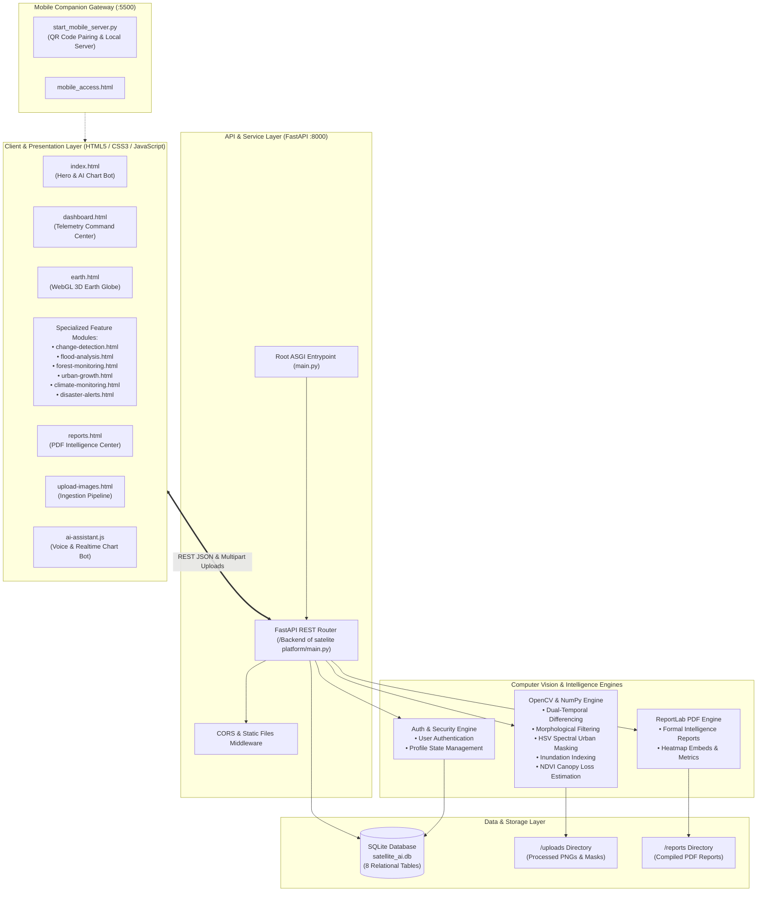

# 01. System Architecture & Design Overview

## 1. Executive Summary
The **Satellite AI Earth Monitoring Platform** is an enterprise-grade Earth Observation (EO) and geospatial monitoring solution. It delivers real-time satellite imagery analysis, dual-temporal change detection, disaster forecasting, climate telemetry visualization, and 3D planetary rendering through a unified full-stack architecture.

---

## 2. High-Level Architecture Diagram

---

## 3. Core Architectural Modules

### 3.1 Presentation Layer (Frontend)
- **Zero-Dependency Architecture**: Built on clean HTML5, modern CSS3 (custom CSS design variables, glassmorphism, glowing telemetry cards), and vanilla JavaScript for performance and instant local execution without complex bundlers.
- **Dynamic Charting Engine**: Embedded **Chart.js** library powering interactive multi-type data visualizations (bar, smooth line, doughnut, radar) with dynamic real-time telemetry streaming.
- **3D WebGL Globe**: Powered by **Three.js**, **OrbitControls**, and **GSAP** delivering orbital physics, atmospheric glow shaders, interactive country raycasting, and satellite constellation tracks.
- **Interactive AI Assistant (Dr. Astra)**: Multi-modal conversational interface with native **Web Speech Recognition API** (speech-to-text) and **Web Speech Synthesis API** (text-to-speech) plus live chart generation.

### 3.2 Backend Service Layer
- **Framework**: **FastAPI** running on top of ASGI **Uvicorn** server.
- **Performance**: Asynchronous non-blocking endpoints for telemetry retrieval combined with multi-threaded image processing routines.
- **Routing**: Over 25 RESTful endpoints handling CRUD operations, analytics execution, file streaming, and PDF generation.

### 3.3 Computer Vision Processing Core
- **Image Differencing**: Multi-scale Sobel gradient calculation and absolute pixel difference matrices.
- **Morphological Structuring**: Elliptical and rectangular morphological opening and closing kernels to remove sensor noise and cluster meaningful land-use changes.
- **Colormap Overlay Generation**: `cv2.COLORMAP_JET` heatmap blending with alpha transparency on post-event satellite imagery.
- **HUD Telemetry Bar Stamping**: Automated programmatic drawing of diagnostic headers, metadata labels, and metric annotations directly onto generated change maps.

### 3.4 Data Persistence & Storage
- **Database Engine**: SQLite (`satellite_ai.db`) with automatic table creation and schema migration checks on startup.
- **File Asset Storage**: UUID-based sanitized storage for uploaded satellite imagery, computed heatmap overlays, and compiled PDF intelligence briefings.

---

## 4. Component Responsibility Matrix

| Subsystem | Key Files | Functional Role |
| :--- | :--- | :--- |
| **Landing & Onboarding** | `index.html`, `style.css`, `index.js`, `intro.html` | First-touch marketing, live coverage counters, AI Chart Bot live demo. |
| **Mission Telemetry** | `dashboard.html`, `dashboard.css`, `dashboard.js` | Mission overview, active satellite fleet monitoring, status diagnostics. |
| **3D Earth Simulation** | `earth.html`, `earth.css`, `earth-3d.js` | Full 3D WebGL globe, orbital paths, country telemetry inspection. |
| **Change Detection** | `change-detection.html`, `change.css`, `script.js` | Dual-temporal comparative analysis with AI/Edge/Pixel algorithms. |
| **Flood Analysis** | `flood-analysis.html`, `flood-analysis.css`, `flood-analysis.js` | Inundation extent, depth calculation, population impact estimation. |
| **Forest Monitoring** | `forest-monitoring.html`, `forest-detection.css`, `forest-monitoring.js` | Canopy coverage, deforestation alerts, NDVI vegetation index proxy. |
| **Urban Sprawl** | `urban-growth.html`, `urban-growth.css`, `urban-growth.js` | Infrastructure expansion, concrete reflectance differencing. |
| **Climate Monitoring** | `climate-monitoring.html`, `climate-monitoring.css`, `climate-monitoring.js`, `national-weather.js` | Weather telemetry, atmospheric indices, Open-Meteo live API sync. |
| **Disaster Network** | `disaster-alerts.html`, `disaster-alerts.css`, `disaster-alerts.js` | Real-time hazard monitoring (Earthquakes, Wildfires, Cyclones). |
| **Reports Archive** | `reports.html`, `reports.css`, `reports.js` | Centralized executive intelligence archive with instant PDF exports. |
| **Image Ingestion** | `upload.html`, `upload-images.html`, `upload-images.css`, `upload-images.js` | Batch and single-image drag-and-drop imagery ingestion. |
| **AI Assistant** | `ai-assistant.js` | Multi-modal voice/chat assistant with real-time Chart.js live controller. |
| **Backend Core** | `Backend of satelite platform/main.py`, `main.py` | FastAPI application, REST endpoints, CV & PDF orchestrators. |
| **Database Core** | `Backend of satelite platform/database.py` | Connection pooling, table schemas, migration hooks, seed data. |
| **Mobile Gateway** | `start_mobile_server.py`, `mobile_access.html`, `open_on_mobile.bat` | Dynamic IP resolution, QR generation, LAN mobile testing server. |
