# 04. Database Architecture & Schema Documentation

## 1. Overview
The Satellite AI Platform uses an embedded **SQLite 3** relational database engine located at `Backend of satelite platform/satellite_ai.db`. The database is managed via `Backend of satelite platform/database.py` with automated migration hooks and connection pooling.

---

## 2. Entity-Relationship Diagram

```mermaid
erDiagram
    USERS {
        INTEGER id PK
        TEXT name
        TEXT email UK
        TEXT mobile
        TEXT password
        TEXT role
        TEXT created_at
    }

    CHANGE_DETECTION_REPORTS {
        INTEGER id PK
        TEXT before_image
        TEXT after_image
        TEXT change_map
        REAL overall_change
        INTEGER changed_pixels
        INTEGER total_pixels
        INTEGER image_width
        INTEGER image_height
        TEXT method
        TEXT location
        TEXT created_at
    }

    URBAN_GROWTH_REPORTS {
        INTEGER id PK
        TEXT before_image
        TEXT after_image
        TEXT change_map
        REAL urban_expansion
        INTEGER changed_pixels
        INTEGER total_pixels
        INTEGER image_width
        INTEGER image_height
        TEXT method
        TEXT location
        TEXT notes
        TEXT created_at
    }

    FLOOD_REPORTS {
        INTEGER id PK
        TEXT before_image
        TEXT after_image
        TEXT change_map
        REAL flood_coverage
        INTEGER changed_pixels
        INTEGER total_pixels
        REAL flood_depth
        REAL rainfall_mm
        INTEGER buildings_damaged
        INTEGER population_affected
        TEXT severity_level
        TEXT location
        TEXT created_at
    }

    FOREST_REPORTS {
        INTEGER id PK
        TEXT before_image
        TEXT after_image
        TEXT change_map
        REAL forest_coverage
        REAL trees_lost
        REAL new_plantation
        TEXT risk_level
        REAL area_scanned_km2
        REAL confidence
        TEXT location
        TEXT created_at
    }

    CLIMATE_REPORTS {
        INTEGER id PK
        REAL temperature
        REAL rainfall_mm
        REAL wind_speed
        REAL humidity
        INTEGER aqi
        REAL cloud_cover
        TEXT status
        TEXT region
        TEXT notes
        TEXT created_at
    }

    DISASTER_ALERTS {
        INTEGER id PK
        TEXT title
        TEXT category
        TEXT location
        TEXT severity
        TEXT magnitude
        TEXT status
        TEXT details
        TEXT created_at
    }

    UPLOADED_IMAGES {
        INTEGER id PK
        TEXT filename
        TEXT original_name
        TEXT category
        TEXT resolution
        INTEGER file_size
        TEXT uploaded_at
    }
```



---

## 3. Database Table Definitions

### 3.1 `users` Table
Stores authenticated researchers, satellite analysts, and system administrators.
| Column | Type | Modifiers | Description |
| :--- | :--- | :--- | :--- |
| `id` | INTEGER | PRIMARY KEY AUTOINCREMENT | Unique user ID |
| `name` | TEXT | NOT NULL | Full user name |
| `email` | TEXT | UNIQUE NOT NULL | User login email |
| `mobile` | TEXT | DEFAULT '' | Contact mobile number |
| `password` | TEXT | NOT NULL | User authentication password |
| `role` | TEXT | DEFAULT 'Researcher' | Role ('Satellite Analyst', 'Admin', 'Researcher') |
| `created_at`| TEXT | NOT NULL | ISO 8601 registration timestamp |

---

### 3.2 `change_detection_reports` Table
Stores results from dual-temporal satellite change detection.
| Column | Type | Description |
| :--- | :--- | :--- |
| `id` | INTEGER PK | Report identifier |
| `before_image` | TEXT | Filename of baseline image in `/uploads` |
| `after_image` | TEXT | Filename of comparative image in `/uploads` |
| `change_map` | TEXT | Filename of generated HUD change map in `/uploads` |
| `overall_change` | REAL | Total change percentage |
| `changed_pixels` | INTEGER | Quantitative count of altered pixels |
| `total_pixels` | INTEGER | Total image pixel resolution |
| `image_width` | INTEGER | Pixel width |
| `image_height` | INTEGER | Pixel height |
| `method` | TEXT | Detection algorithm used (`'ai'`, `'edge'`, `'pixel'`) |
| `location` | TEXT | Geospatial reference sector |
| `created_at` | TEXT | Timestamp of report generation |

---

### 3.3 `urban_growth_reports` Table
Records infrastructure sprawl and urban expansion assessments.
- Includes `urban_expansion` (REAL, percentage growth), `notes` (TEXT, analyst commentary), `location` (TEXT), and image references.

---

### 3.4 `flood_reports` Table
Stores hydrologic and flood disaster analyses.
- Includes `flood_coverage` (%), `flood_depth` (m), `rainfall_mm` (mm), `buildings_damaged` (count), `population_affected` (count), and `severity_level` (`'Critical'`, `'High'`, `'Medium'`).

---

### 3.5 `forest_reports` Table
Tracks canopy dynamics and deforestation risks.
- Includes `forest_coverage` (%), `trees_lost` (%), `new_plantation` (%), `risk_level` (`'Low'`, `'Medium'`, `'High'`, `'Critical'`), `area_scanned_km2` (km²), and `confidence` (%).

---

### 3.6 `climate_reports` Table
Atmospheric telemetry logs.
- Includes `temperature` (°C), `rainfall_mm` (mm), `wind_speed` (km/h), `humidity` (%), `aqi` (Air Quality Index), `cloud_cover` (%), `status`, and `region`.

---

### 3.7 `disaster_alerts` Table
Live emergency hazards register.
- Includes `title`, `category` (`'earthquake'`, `'flood'`, `'fire'`, `'cyclone'`, `'landslide'`), `location`, `severity` (`'Critical'`, `'High'`, `'Medium'`), `magnitude`, `status`, and `details`.

---

### 3.8 `uploaded_images` Table
Catalog of ingested satellite files.
- Includes `filename` (UUID file in `/uploads`), `original_name`, `category`, `resolution`, `file_size` (bytes), and `uploaded_at`.

---

## 4. Connection & Migration Handling

Connections use `sqlite3.Row` row factory for dictionary-like column access:
```python
def get_connection():
    connection = sqlite3.connect(DATABASE_NAME, check_same_thread=False)
    connection.row_factory = sqlite3.Row
    return connection
```

On backend startup, `ensure_column_exists(cursor, table, column, def)` inspects `PRAGMA table_info()` and applies non-destructive schema migrations seamlessly.
